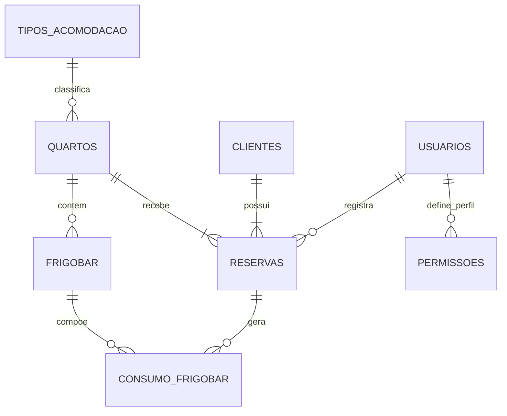

# Relacionamentos para o BrModelo

## Entidades e chaves

- `usuarios`: PK `id`
- `clientes`: PK `id`
- `quartos`: PK `id`
- `tipos_acomodacao`: PK `id`
- `reservas`: PK `id`, FKs `quarto_id`, `cliente_id`, `usuario_id`
- `frigobar`: PK `id`, FK `quarto_id`
- `consumo_frigobar`: PK `id`, FKs `reserva_id`, `frigobar_id`
- `logs_sistema`: PK `id`
- `permissoes`: PK `id`

## Relacionamentos fisicos do banco

- `usuarios.id` 1:N `reservas.usuario_id`
  Um usuario pode registrar varias reservas. Uma reserva pode ter um usuario responsavel.
- `clientes.id` 1:N `reservas.cliente_id`
  Um cliente pode possuir varias reservas. Cada reserva pertence a um cliente.
- `quartos.id` 1:N `reservas.quarto_id`
  Um quarto pode aparecer em varias reservas ao longo do tempo. Cada reserva referencia um unico quarto.
- `quartos.id` 1:N `frigobar.quarto_id`
  Um quarto pode ter varios itens de frigobar. Cada item pertence a um unico quarto.
- `reservas.id` 1:N `consumo_frigobar.reserva_id`
  Uma reserva pode gerar varios consumos de frigobar.
- `frigobar.id` 1:N `consumo_frigobar.frigobar_id`
  Um item de frigobar pode aparecer em varios registros de consumo.

## Relacionamentos logicos para desenhar no BrModelo

- `tipos_acomodacao.nome` 1:N `quartos.tipo`
  O sistema usa `quartos.tipo` como catalogo textual de tipos de acomodacao. No banco atual isso e um relacionamento logico, ainda sem chave estrangeira.
- `usuarios.perfil` 1:N `permissoes.perfil`
  As permissoes sao agrupadas por perfil (`adm` ou `user`). Depois da migracao esse vinculo fica apenas logico para evitar dependencia estrutural indevida em uma coluna nao unica.
- `logs_sistema`
  Tabela independente de auditoria. No BrModelo ela pode ficar sem relacionamento fisico, pois hoje nao existe FK ligando os logs a outras entidades.

## Vista rapida

## Observacoes para modelagem

- `reservas.usuario_id` aceita `NULL`, entao no BrModelo o lado de `reservas` pode ser opcional em relacao a `usuarios`.
- `logs_sistema` pode ser representada como entidade autonoma.
- Se voce quiser transformar `tipos_acomodacao` em relacionamento fisico no futuro, o melhor caminho e trocar `quartos.tipo` por `quartos.tipo_id`.
