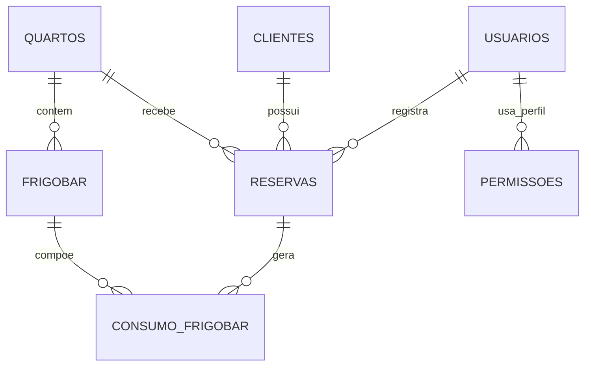

# Modelo logico do banco `parnaiocagabriel`

## Entidades

- `usuarios`: credenciais e perfil de acesso dos operadores.
- `clientes`: dados cadastrais dos hospedes.
- `quartos`: unidades disponiveis para hospedagem.
- `tipos_acomodacao`: classificacao dos quartos.
- `reservas`: vinculo entre cliente, quarto e usuario que registrou a reserva.
- `frigobar`: itens disponiveis por quarto.
- `consumo_frigobar`: consumo registrado dentro de uma reserva.
- `logs_sistema`: trilha de auditoria do sistema.
- `permissoes`: autorizacoes por perfil e pagina.

## Relacionamentos

## Regras principais

- Um `cliente` pode ter varias `reservas`.
- Um `quarto` pode aparecer em varias `reservas`, mas cada reserva pertence a um unico quarto.
- Um `usuario` pode registrar varias `reservas`.
- Cada item de `frigobar` pertence a um unico `quarto`.
- O `consumo_frigobar` depende simultaneamente de uma `reserva` e de um item do `frigobar`.
- As `permissoes` controlam acesso por `perfil` e `pagina`, com unicidade por combinacao.

## Observacoes

- A tabela `tipos_acomodacao` hoje funciona como catalogo de tipos e pode ser ligada formalmente a `quartos.tipo` em uma futura normalizacao.
- No arquivo `database/schema_atualizado.sql` eu deixei a versao do esquema com as chaves estrangeiras explicitas para facilitar manutencao.
